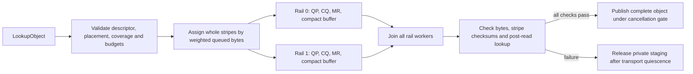

# Multi-rail RDMA read design and verification

This document describes the opt-in implementation in [draft PR #32](https://github.com/DaoCloud/ContextStore/pull/32), based independently on official `main` at `b5c6451`. It preserves the stored object and disk stripe layout and the existing upper-level read methods. The new Rust SDK entry point is `KvClient::read_multi_rail_into`.

## Path model and rollout

A `RailRoute` associates a placement-advertised storage endpoint with a stable rail ID, client local RDMA device/port/GID, remote listener, enabled state and positive capacity weight. Two routes for one owning node must use distinct local ports or devices and distinct listeners. The server's `CS_RDMA_DEVICES` starts a listener and Verbs context for each configured device. The administrator maps both listeners to the same storage owner; the client validates that a route's advertised endpoint matches the placement before it can schedule any stripe.

Configure and verify the additional server listener first, deploy a client with the new SDK, then enable its second route. A single route uses the same new read state machine. Existing gRPC reads and old RDMA clients continue using their original interfaces. A client that opts into tag-15 scatter reads needs a server version with that wire handler; rolling upgrades must enable multi-rail only after the owning servers have it. There is no automatic listener discovery or protocol negotiation in this version.

## One read

The planner rejects missing, duplicate, out-of-range or inconsistent stripe descriptions before transport. It keeps each stripe's original object offset and owning endpoint; the assignment changes only which network path carries that stripe. The weighted scheduler favors the rail with less assigned bytes relative to its weight. Each worker registers a compact receive buffer for its own stripes plus the required safe dummy segment, maps the object ranges to tag-15 SGEs, and verifies every SGE stays within its MR. The service writes only the requested stripe subset into those destinations. Slab and registered-buffer fallback paths use the same SGE mapping.

The reader joins every started worker. It checks the reported byte and chunk counts, requires every planned byte exactly once, and compares per-stripe xxh3 when the placement supplies checksums. A partially populated checksum list is invalid. After transfer, the SDK repeats `LookupObject` and compares object key, handle, Generation, content ETag, Layout Version, size, stripe count/size and complete placement. It copies the assembled object to the caller only if these checks pass. Cancellation and publication hold the same gate; whichever enters first determines whether publication occurs.

`verify_stripe_checksums` is off by default on the server. A new checksummed test object must be written after enabling it. Old objects without checksums are readable under their original policy, but their reads do not claim per-stripe integrity verification.

## Ownership and failure semantics

| Event | Observable result | Lifetime rule |
| --- | --- | --- |
| Route disabled or temporarily cooling down | Another eligible rail may be chosen for a later request; one rail remains valid | No same-request retry after a required rail fails |
| Invalid descriptor/placement or resource limit | Typed error before data transfer | No MR or caller-buffer mutation |
| Rail timeout, disconnect, CQ failure or worker panic | Entire object read fails; no partial publish | Worker stops using QP before deregistering MR and releasing private target memory |
| Checksum mismatch or post-read version/placement change | Entire object read fails | All workers are joined; private data is discarded |
| Cancellation | Error if cancellation wins the publication gate | In-flight rail tasks first quiesce; destination stays unchanged |
| Server WRITE completion uncertain | Server closes that control connection | Source `SlabExtent`, cached pin, or `(MR, Bytes)` remains owned by `RcQp` until its Drop destroys the QP; the old CQ is not reused |
| Client GET control send/receive error | Client QP is destroyed and the control stream shut down | Destination MR may be released or reused only after QP destruction |

The server's CQ deadline is controlled by `CS_RDMA_CQ_TIMEOUT_MS`, clamped to 100–30,000 ms, defaulting to 30,000 ms. A cache-miss legacy complete-object GET distinguishes a pre-WRITE storage failure, where fallback may still be valid, from an uncertain posted WRITE, where it pins the extent and exits the connection. Cache-hit and per-chunk legacy GETs also retain every posted source on post or CQ errors. This closes the stale-CQE and slab-reuse hole exposed by independent review. The [RXE receipts](../kv-service/benchmarks/results/softroce-vm-test-manifest.json) include a post-handshake 1 ms legacy GET timeout, 2 s server CQ timeout with 0/64 completions, connection retirement and six-second caller-buffer reuse check.

## Resource bounds and observability

One `RailReader` reserves active reads, final/per-rail staging bytes, registered lengths, total in-flight object bytes, and per-rail task/in-flight bytes across concurrent calls. Defaults include eight active reads, eight tasks per rail, 4 GiB staging/registration/in-flight ceilings and 2 GiB per-rail in-flight ceiling; callers can lower these in `RailLimits`. On Linux, finite process `RLIMIT_MEMLOCK` caps the effective registration budget at 80% of the soft limit. Preflight reservation returns `ResourceExhausted` before launching excess work. The server QP has a 128-WR send depth and the slab streaming path polls in a bounded completion window.

`RailSnapshot` and the CLI expose each route's healthy/cooldown status, successful/failed reads, transferred bytes, latency, current and peak in-flight requests/bytes, current and peak registered bytes, local device, listener, and sysfs NUMA/PCI address when present. Multiple separately constructed `RailReader` instances do not share one process-wide budget; deployments using several instances must enforce a shared outer cap.

Topology is currently reported and selected through explicit route configuration/weights. The scheduler does not yet measure live NIC bandwidth or automatically choose NUMA/PCIe affinity. RXE devices correctly report absent physical PCI/NUMA identity rather than inventing it.

## Verification and measurement limits

Run the hardware-independent Rust tests on any Linux host with libibverbs available; the ignored real-Verbs tests require configured listeners. [README](../README.md) lists the commands, the [portable two-VM scripts](../kv-service/deploy/softroce-vm/) recreate two independent RXE paths, and [raw paired samples](../kv-service/benchmarks/results/softroce-vm-paired-samples.csv) plus [analysis](../kv-service/benchmarks/results/softroce-vm-analysis.json) allow recalculation. A [four-minute demonstration](https://github.com/yanchaomei/ContextStore/releases/tag/multi-rail-softroce-demo-2026-10-02) includes the live command/output JSON and an edited, narrated video.

The paired RXE run uses the same object, layout, virtual disk, guests, server and concurrency within each one/two-rail cell. Single-concurrency ratios at 64/128/256 MiB are 1.071×/1.086×/1.113×; at 64 MiB with four concurrent reads the aggregate ratio is 1.018×. CPU and memory costs rise. These are software-RoCE/QEMU results on one physical host and one virtual disk. A separate physical ConnectX-6 Dx run measures one rail only. Two physical HCA paths, separate NVMe supply, PCIe/NUMA effects and physical link aggregation remain unmeasured; neither the RXE nor Mock results imply those properties.
